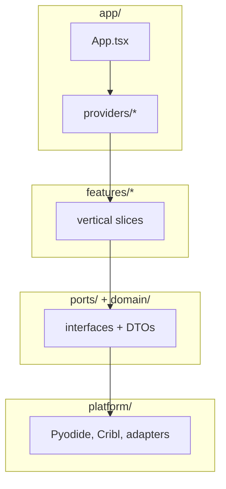
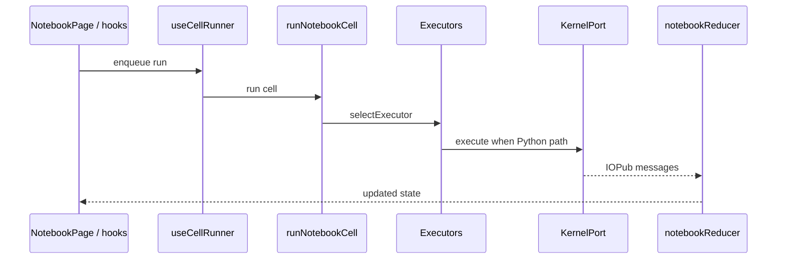

# Notebook App — Architecture

A human- and LLM-friendly map of the codebase. This document is the
authoritative description of the **layering**. If you change the layering here,
update `tsconfig.app.json > paths` to match.

**Companion docs:**

- [`docs/NAVIGATE.md`](./NAVIGATE.md) — task-oriented entry: first files to open, diagrams, and “if you want to…” pointers.
- [`docs/PLATFORM.md`](./PLATFORM.md) — how the app talks to Cribl (globals, fetch proxy, KV, config groups, `proxies.yml`).
- [`docs/PYODIDE_CUSTOMIZATIONS.md`](./PYODIDE_CUSTOMIZATIONS.md) — non-default Pyodide/worker behavior + upgrade checklist.
- [`docs/E2E_STAGING.md`](./E2E_STAGING.md) — Playwright staging E2E.

## Layering at a glance

```
┌──────────────────────────── app/ ─────────────────────────────┐
│  App.tsx composes every provider and mounts NotebookPage.     │
│  Providers wire real adapters onto abstract Ports.            │
└───────────────────────────────┬───────────────────────────────┘
                                │ depends on
                 ┌──────────────┴──────────────┐
                 ▼                             ▼
       ┌──────────────────┐           ┌──────────────────┐
       │  features/*      │           │  ports/*         │
       │  (vertical       │  depends  │  interfaces      │
       │   slices)        │─────────▶│  KernelPort, …    │
       └──────────┬───────┘           └─────────┬────────┘
                  │                              │
                  │ shared models                │
                  ▼                              ▼
       ┌──────────────────┐           ┌──────────────────┐
       │  domain/*        │           │ platform/adapters│
       │  transport-level │◀─────────▶│ map concrete I/O │
       │  DTOs            │           │ to port contracts│
       └──────────┬───────┘           └─────────┬────────┘
                  │                              │
                  ▼                              ▼
       ┌──────────────────┐           ┌──────────────────┐
       │  platform/*      │           │ app/providers/*  │
       │  concrete I/O    │           │ composition/wire │
       │  Pyodide, Cribl  │           │ default adapters │
       └──────────────────┘           └──────────────────┘
```

### Diagrams (Mermaid)




The exact nesting lives in [`src/App.tsx`](../src/App.tsx). Per-tab widget state
(ipywidgets) is provided lower down, inside `NotebookPage`, by
`TabWidgetManagerProvider` (see `features/notebook/widgets/`).

### Why this shape?

- **Feature-sliced:** each product feature owns its vertical (model,
  reducer, hooks, UI) in one folder, so changes land in a single slice
  instead of rippling through "types / reducers / components / api"
  silos.
- **Hexagonal:** features depend on interfaces (`ports/`), not on
  concrete network clients or browser APIs. The only code that talks
  to the real Pyodide worker, the Cribl API, or `localStorage` is in
  `platform/` (and a thin adapter glue in `app/providers/`).
- **Composition root:** all wiring lives in `app/App.tsx` + the
  providers. That's the only place where "this abstract port is served
  by this concrete adapter" is spelled out — one place to swap for
  tests, for a different backend, or for a demo mode.

## Directory responsibilities

### `src/app/`

- `App.tsx` — top-level composition. Wraps `NotebookPage` in every
  provider; does nothing else.
- `app/providers/` — React Context providers that expose ports.
  - `EnvProvider` / `useEnv` — current `EnvService` snapshot (Cribl
    API base, KV-mock flag, hosted-or-local flag).
  - `ThemeProvider` / `useTheme` — Capra **light/dark** mode: toggles the
    `.dark` class on `document.documentElement`, persists `nb-capra-theme`, and
    migrates legacy `nb-app-style` / `nb-theme` prefs. Notebook surfaces use
    `--nb-*` tokens bridged from Capra (`capra-nb-bridge.css`). CodeMirror
    receives a matching `light`/`dark` luma hint for editor chrome.
  - `DialogProvider` / `useDialogs` — imperative alert/confirm/prompt
    built on `NotebookDialog`. Replaces the old inline dialog state
    inside `NotebookPage`.
  - `AiCodeProvider` / `useAiCodeService` — injects an `AiCodeService`
    implementation. Production: `riptideAiCodeService`. Tests pass a
    stub via the `value` prop.
  - `SearchProvider` / `useSearchService` — injects `SearchService` for
    `%%cribl_search`. Production: `criblSearchService` in
    `platform/adapters/searchServiceAdapter.ts`.
  - `LookupProvider` / `useLookupService` — injects `LookupService` for the
    `%%cribl_save_search_lookup` / `%%cribl_load_search_lookup` /
    `%%cribl_delete_search_lookup` magics (Cribl Search lookup CRUD).
  - `NotebookRepoProvider` / `useNotebookRepo` — injects `NotebookRepo` for
    library manifest + notebook payload I/O. Production: `kvNotebookRepo` in
    `platform/adapters/notebookRepoAdapter.ts`.
  - `KernelProvider` / `useKernelFactory` / `useOptionalKernelFactory` —
    injects `KernelFactory` (Pyodide). Notebook hooks fall back to an
    explicit factory argument in unit tests.

### `src/features/`

- `notebook/` — the notebook itself.
  - `model/types.ts` — domain types: `Cell`, `CodeCell`, `MarkdownCell`,
    `NotebookState`, and the `NotebookAction` union (grouped into
    `CellStructureAction`, `CellExecutionAction`, `CellOutputAction`,
    `NotebookLifecycleAction` for readability).
  - `reducer/` — pure reducers:
    - `notebookReducer` — single cell/notebook reducer.
    - `tabWorkspace` — multi-tab workspace reducer wrapping it.
    - IOPub output folding lives in `@/domain/iopubOutputArea` (used by the reducer
      **and** by `PyodideKernel`, so there is exactly one implementation of
      `clear_output { wait: true }`).
  - `codec/ipynb.ts` — nbformat 4 read/write (round-trips to
    `.ipynb`).
  - `executor/` — cell execution strategies.
    - `cellExecutor.ts` — `CellExecutor` / `CellRunOutcome` interfaces.
    - `pythonExecutor.ts` — default kernel.execute() path.
    - `criblSearchExecutor.ts` — `%%cribl_search` magic.
    - `criblSearchLookupExecutor.ts` — `%%cribl_save_search_lookup` / `%%cribl_load_search_lookup` / `%%cribl_delete_search_lookup`.
    - `executorRegistry.ts` — `createDefaultCellExecutors(searchService,
      criblApiBase, lookupService)` builds the ordered list (cribl-api →
      cribl-search-lookup → cribl-search → Python). Specialized matchers come
      before the catch-all Python executor.
    - `runNotebookCell.ts` — thin dispatcher that picks an executor
      and delegates.
  - `hooks/` — React hooks orchestrating the page.
    - `useNotebookWorkspace` — owns the tab-workspace reducer + refs
      (`workspaceRef`, `activeTabIdRef`) + dispatch helpers.
    - `useTabNotebookRuntime` — per-tab Pyodide lifecycle
      (`TabRuntimeController`: kernel, generation, queue, execution
      count, scheduled set). Uses `KernelProvider` in production; accepts an
      optional `KernelFactory` as the fourth argument for tests.
    - `useCellRunner` — `runCell` / `runCellAndAdvance` / `runAll` /
      `restartKernel` / `stopExecution` / `canStopExecution`. Builds the
      `useSearchService` + `useLookupService` + `useEnv().apiBase` so
      `criblSearchExecutor` / `criblSearchLookupExecutor` call ports, not
      `platform/cribl/*` directly.
  - `ui/` — the React components that paint the page.
    `NotebookPage.tsx` is the page composition; `Toolbar`, `CellList`,
    `CellView`, `NotebookTabs`, `NotebookDialog`, `MimeBundleView`, …
  - `widgets/` — **ipywidgets** bridge. `NotebookWidgetManager` (extends
    `@jupyter-widgets/base-manager`) maps Jupyter comm IOPub traffic to widget
    models/views and forwards outbound `comm_msg` to the kernel via
    `KernelPort.postComm`. Wired per-tab through `TabWidgetManagerProvider` /
    `useTabWidgetManager`; `WidgetMimeView` renders the widget MIME type.
- `library/` — saved notebooks in KV.
  - `manifest.ts` — pure manifest model + validators.
  - `notebookLibrary.ts` — manifest + `.ipynb` orchestration; async persistence
    helpers take `NotebookRepo` (from `useNotebookRepo`).
  - `hooks/useNotebookLibrary.ts` — manifest state + auto-load effect
    + selections + `saveBusy` + `moveDestinations`.
  - `ui/NotebookSidebar.tsx` — tree view.
- `cribl-search/` — parser/editor/renderer for the `%cribl_search`
  magic. Used by the executor and by the CodeMirror KQL highlighter
  in `ui/editor/`.
- `cribl-api/` — `%%cribl_api` cell magic: OpenAPI-backed path completion,
  HTTP execution, and integration with notebook Jinja helpers.
- `ai-riptide/` — Cribl Riptide integration (one-shot Python generate / fix).
- `ai-chat/` — AI Chat left-panel mode; multi-turn `open_investigator` with client tools that insert cells into the active notebook (or create one).
  - `riptideService.ts` — raw request/response helpers.
  - `app/riptideAiCodeAdapter.ts` — `riptideAiCodeService` implementing the
    `AiCodeService` port (and reporting `isAvailable()` based on the
    Cribl API base).
- `examples/` — bundled notebook examples.
  - `examplesManifest.ts` — pure manifest parsing.
  - `useExamples.ts` — fetches `/Examples/manifest.json`, tracks
    loading/error/selected state, supports `fetch` injection for
    tests.
- `welcome/` — `WelcomePage` + release notes. Now a thin view over
  `useExamples`.

### `src/platform/`

Adapters for real I/O. These are the **only** modules allowed to
touch the network, `window`, or browser workers directly.

- `platform/pyodide/` — Pyodide kernel.
  - `PyodideKernel.ts` — class talking to the Web Worker. Imports
    `kernel.worker.js?raw`, injects two Python bootstrap scripts as
    string substitutions, spawns the Blob-URL worker.
  - `kernel.worker.js` — dedicated worker source (type/lint coverage).
  - `PyodideKernelAdapter.ts` — `KernelFactory` /
    `pyodideKernelFactory` satisfying the `KernelPort` port.
  - `packageFetchCache.ts` — in-memory + Cache API for lazy Pyodide fetches
    (registry hosts plus same-origin `pyodide/*` when bridged from the worker;
    see `PyodideKernel` / `kernel.worker.js`). `pyodideVersion.ts` — runtime
    URLs and release string.
  - `docs/PYODIDE_CUSTOMIZATIONS.md` — upgrade checklist and all non-default
    Pyodide/worker behavior that must be revalidated on version bumps.
- `platform/cribl/` — Cribl network clients: `kvstore`, `searchJobs`,
  `aiTranslate`, …
- `platform/env/env.ts` — environment detection
  (`getCriblApiBase`, `isKvMockMode`, `readEnv`).
- `platform/staticAssets.ts` — resolving static asset URLs under
  `CRIBL_BASE_PATH` vs. local dev.
- `platform/adapters/` — anti-corruption adapters that map concrete
  `platform/*` payloads into `ports/*` contract DTOs.
  - `notebookKv.ts` — scoped KV read/write for manifest + notebook payloads
    (`kvFetchManifest`, …); used by `notebookRepoAdapter` and orchestration in
    `features/library/notebookLibrary.ts`.

### `src/domain/`

Pure transport/domain DTOs shared across `ports/*`, features, and adapters.
This avoids `ports/*` importing from `platform/*` or feature internals.

- `domain/kernel.ts` — Jupyter-shaped IOPub messages (including comm messages for
  widgets), MIME bundles, and cell output records (single source for the notebook
  reducer + kernel port).
- `domain/iopubOutputArea.ts` — pure IOPub → output-record folding (shared by
  `notebookReducer` and `PyodideKernel`).
- `domain/criblCellMagicSource.ts` — line/offset helpers for `%%cribl_*` cell magics
  (shared by notebook executors and cribl-search / cribl-api parsers).
- `domain/criblSearchMime.ts` — `%%cribl_search` structured display MIME key +
  payload union.
- `domain/search.ts` — shared Cribl Search result + progress DTOs.
- `domain/notebookManifest.ts` / `domain/library.ts` — library manifest model
  helpers, KV key paths, and tree/move utilities (shared by `features/library` and
  `platform/adapters/notebookKv.ts` so repo adapters need not import feature internals).
- `domain/exampleDataUrls.ts` — allowed sample-data URLs for bundled examples.
- `domain/criblUser.ts` — `getCriblUser` shape used for per-user KV scoping.
- `domain/tagFilter.ts` — pure tag-filtering helper for the library / examples UI.
- `domain/index.ts` — barrel re-exporting the common DTO types.

### `src/ports/`

Pure interfaces. Importing from `ports/` is free — no runtime cost,
no coupling to a specific adapter.

| Port | Purpose | Default adapter |
|---|---|---|
| `KernelPort` | Python kernel lifecycle + execute/complete | `PyodideKernelAdapter` |
| `NotebookRepo` | Save/load notebooks (+ manifest) | `kvNotebookRepo` (`platform/adapters/notebookRepoAdapter.ts`) |
| `AiCodeService` | Natural-language → Python, error-fix suggestions | `riptideAiCodeService` (`app/riptideAiCodeAdapter.ts`) |
| `SearchService` | Cribl Search job orchestration | `criblSearchService` (`platform/adapters/searchServiceAdapter.ts`) |
| `LookupService` | Cribl Search lookup file CRUD (`%%cribl_*_search_lookup`) | Search lookup adapter (`/m/{group}/system/lookups`) |
| `DialogService` | alert / confirm / prompt | `DialogProvider` |
| `EnvService` | Env snapshot (API base, KV mock, hosted flag, static asset prefix) | `readEnv()` |

### `src/ui/`

Framework-agnostic UI primitives. Currently just the CodeMirror
Python / KQL setup in `ui/editor/pythonCodeMirror.ts`. Anything that
could be reused outside this feature pie should land here.

### `src/testing/`

- `setup.ts` — Vitest setup (`@testing-library/jest-dom` matchers,
  per-test cleanup).
- `appSmoke.test.tsx` — end-to-end shell smoke test with mocked
  KV fetch and a fake `KernelFactory`, proving every provider and
  hook composes without runtime errors.

## Import rules

- `tsconfig.app.json > paths` maps `@/*`, `@app/*`, `@domain/*`, `@features/*`,
  `@platform/*`, `@ports/*`, `@ui/*`, `@testing/*` — prefer these
  aliases whenever an import would otherwise reach across a layer.
- Layering contract:

  | From ↓ / to → | app | features | platform | ports | ui |
  |---|---|---|---|---|---|
  | `app/`        | ✓   | ✓        | ✓        | ✓     | ✓  |
  | `features/`   | ✗   | own slice only (see below) | ✗ (use ports) | ✓ | ✓ |
  | `platform/`   | ✗   | ✗        | ✓        | ✓     | ✓ |
  | `ports/`      | ✗   | ✗        | ✗        | ✓     | ✗ |
  | `ui/`         | ✗   | ✗        | ✗        | ✗     | ✓ |

- Within `features/`: cross-slice imports are allowed *only* through a
  slice's public barrel (today that means `@features/library/*`,
  `@features/cribl-search/*`, etc.). Cross-slice reaches into private
  internals are a smell — extract a helper into the consumer's own
  slice or into `ui/` first.

### Known layering drift (intentional / in progress)

- `features/notebook/executor/executorRegistry.ts` is the **composition point** that
  imports `@platform/adapters/cellExecutorFetchHelpers` so individual executors stay
  free of direct `@platform/cribl/*` imports.
- Library persistence goes through **`NotebookRepo`** (`useNotebookRepo` /
  `NotebookRepoProvider`); `features/library/notebookLibrary.ts` takes a `NotebookRepo`
  argument for all KV-backed operations and no longer imports `@platform/*`.

### Notebook hooks and `app/providers`

`NotebookPage`, `useCellRunner`, `useTabNotebookRuntime`, and related UI import
`@app/providers` to read port implementations from React context. ESLint **errors** on
`@platform/*` under `src/features/**` (tests are exempt). `@app/providers` is allowed
from features; other `@app/*` paths stay restricted (for example `@app/styles/*` — use
the theme re-exports on the providers barrel — and `@app/riptideAiCodeAdapter`, which
is only for `AiCodeProvider` wiring).

### Notebook orchestration layout (cohesion map)

Orchestration — async commands, tab/workspace side effects, and run-queue wiring —
is split across focused modules under `features/notebook/hooks/` so
`NotebookPage` stays mostly composition and JSX.

| Concern | Modules |
|--------|---------|
| Cell run queue (serialized per tab) | `useCellRunner.ts`, `cellRunnerQueue.ts` |
| KV library save / open / manifest CRUD / import / examples | `useNotebookLibraryActions.ts`, `notebookLibraryAsyncCommands.ts`, `notebookLibraryWorkspaceSync.ts` |
| Per-tab Pyodide + widget bridge | `useTabNotebookRuntime.ts` |
| Workspace + tab reducer wiring | `useNotebookWorkspace.ts` |
| Code completion + Riptide prompt → cell source | `useNotebookPageCompleteCode.ts`, `useNotebookPageAiGenerate.ts` |
| Tab chrome (close / select / new / download) | `useNotebookPageTabChrome.ts` |

Cross-feature imports should use each slice’s `index.ts` barrel (`@features/library`,
`@features/welcome`, `@features/examples`, `@features/cribl-search`, `@features/ai-riptide`,
`@features/ai-chat`)
instead of deep paths into another feature’s `ui/` or `hooks/` folders. ESLint also
discourages deep `@features/<slice>/...` imports from `src/app/` and `src/ui/` so
composition and shared editor code stay coupled to public surfaces only.

## Execution pipeline (mental model)

```
User clicks Run
  → NotebookPage calls runCellAndAdvance(cellId, idx)
  → useCellRunner enqueues on the tab's run queue (TabRuntime)
  → When it's this cell's turn:
      dispatch(SET_RUNNING) → reducer marks cell running
      await kernel.ready     (KernelPort; real impl = Pyodide worker)
      dispatch(SET_KERNEL_STATUS busy)
      pick executor via selectExecutor(source, DEFAULT_CELL_EXECUTORS):
        %%cribl_api    → criblApiExecutor
        %%cribl_save_search_lookup / %%cribl_load_search_lookup / %%cribl_delete_search_lookup → criblSearchLookupExecutor
        %%cribl_search → criblSearchExecutor
        else          → pythonExecutor
      executor drives kernel.execute(...) and emits IOPub messages
      emit → dispatch(IOPUB)     (reducer folds via applyIOPub)
      success → dispatch(FINISH_CELL)
      error   → dispatch(ERROR_CELL) + CLEAR_ALL_PENDING (halts queue)
      stale   → bail silently (generation has been bumped)
      finally → dispatch(SET_KERNEL_STATUS ready)
```



### Stop / restart semantics

- `stopExecution` bumps the tab's generation (so queued `.then` bodies
  bail on their next stale check), clears the scheduled set, drops the
  queue Promise, disposes the kernel, marks any running cell errored,
  and starts a fresh kernel.
- `restartKernelForTab` is the same flow minus the "mark running
  cell errored" step — used for an explicit "Restart kernel" click.

## Keeping architecture docs current

Update docs in the same change when you:

- Add or rename **`src/features/*`** slices — feature list in this file and the tables in [`docs/NAVIGATE.md`](./NAVIGATE.md).
- Change **`src/App.tsx`** provider nesting or add a provider — provider list above and the Mermaid provider stack (here and in [`docs/NAVIGATE.md`](./NAVIGATE.md)).
- Add a **port** or change a default adapter — ports table under `src/ports/`.
- Change **executor order** or run semantics — execution pipeline (text + diagrams) in this file and the run row in [`docs/NAVIGATE.md`](./NAVIGATE.md).
- Change **`tsconfig.app.json` path aliases** — keep the alias list in [`AGENTS.md`](../AGENTS.md) in sync.
- Change **Cribl platform integration** (fetch proxy, KV keys, config groups, `proxies.yml`) — update [`docs/PLATFORM.md`](./PLATFORM.md), the single source for those rules.

## Testing

- `npm test` runs Vitest over `src/**/*.test.{ts,tsx}`.
- JSDOM + React Testing Library for UI and hook tests; setup lives in
  `src/testing/setup.ts`.
- Integration smoke: `src/testing/appSmoke.test.tsx` renders the whole
  App shell with stubbed KV and a fake `KernelFactory`.
- **Staging E2E:** Playwright specs under `e2e/specs/` exercise a live Cribl
  tenant (iframe + real shell): shell mount, welcome/examples, new notebook tab,
  toolbar, CodeMirror, Pyodide readiness, and a timing budget. Auth is gitignored;
  flow and **when to update specs** are documented in [`docs/E2E_STAGING.md`](./E2E_STAGING.md).
- Unit tests you can copy from as templates:
  - `src/features/notebook/hooks/useTabNotebookRuntime.test.tsx`
  - `src/features/notebook/hooks/useNotebookWorkspace.test.tsx`
  - `src/features/library/hooks/useNotebookLibrary.test.tsx`
  - `src/features/notebook/executor/cellExecutor.test.ts`
  - `src/features/notebook/executor/pythonExecutor.test.ts`
  - `src/features/notebook/reducer/pendingClear.test.ts`
  - `src/app/providers/DialogProvider.test.tsx`
  - `src/app/providers/EnvProvider.test.tsx`
  - `src/app/providers/ThemeProvider.test.tsx`
  - `src/features/examples/useExamples.test.tsx`

## Adding a feature (recipe)

1. Create `src/features/your-feature/`.
2. Put types in `model/`, pure logic in `reducer/` or helpers, hooks
   in `hooks/`, and React components in `ui/`.
3. If the feature needs I/O, **define a port first** in `ports/` and
   provide an adapter in `platform/`. Wire the port in
   `app/providers/` so tests can substitute.
4. Import using `@features/your-feature/...` aliases; don't reach into
   another feature's internals.
5. Add a test next to each hook/executor/reducer you add.
6. If the change affects **primary UX** (welcome, tabs, sidebar, toolbar,
   examples, kernel banner, or load performance), extend or adjust Playwright
   specs under `e2e/specs/` per [`docs/E2E_STAGING.md`](./E2E_STAGING.md).

## Adding a new cell execution mode (recipe)

1. Implement the `CellExecutor` interface in
   `src/features/notebook/executor/`.
2. Add it to `DEFAULT_CELL_EXECUTORS` **before** `pythonExecutor` (the
   Python executor matches everything as a fallthrough).
3. Add a test covering `matches()` and the ok/error paths in the new
   executor file.
