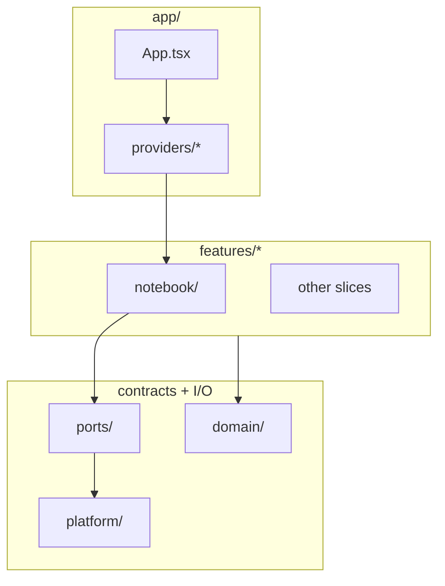
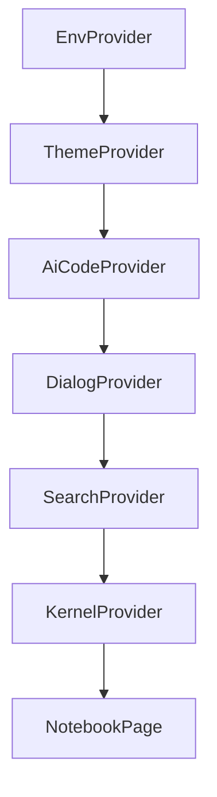
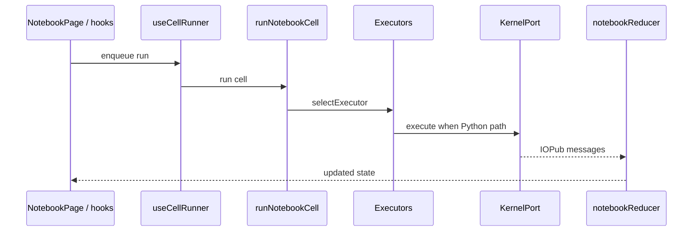

# Navigate the codebase

Task-oriented map for humans. For layering rules, port tables, and recipes in depth, see [ARCHITECTURE.md](./ARCHITECTURE.md).

## Five-minute orientation

1. **Composition root:** [`src/App.tsx`](../src/App.tsx) nests providers (env, theme, AI, dialogs, search, kernel) then mounts [`NotebookPage`](../src/features/notebook/ui/NotebookPage.tsx).
2. **Main page:** `NotebookPage` composes toolbar, tabs, cells, and wires hooks for workspace + runtime + cell runs.
3. **State:** Tab workspace and notebook content are driven by reducers under [`src/features/notebook/reducer/`](../src/features/notebook/reducer/).
4. **Execution:** [`useCellRunner`](../src/features/notebook/hooks/useCellRunner.ts) queues work per tab; [`runNotebookCell`](../src/features/notebook/executor/runNotebookCell.ts) picks an executor from [`executorRegistry.ts`](../src/features/notebook/executor/executorRegistry.ts) (order: `%%cribl_api` → `%cribl_search` → Python).
5. **I/O:** Concrete `fetch`, workers, and KV live under [`src/platform/`](../src/platform/). Features talk to **ports** (`src/ports/`) and read implementations from **`app/providers/`** in production.

## `src/features/` at a glance

| Slice | Responsibility | Good entry files |
| --- | --- | --- |
| `notebook/` | Cells, tabs, execution, codec, main UI | `ui/NotebookPage.tsx`, `hooks/useCellRunner.ts`, `hooks/useTabNotebookRuntime.ts`, `executor/executorRegistry.ts`, `reducer/notebookReducer.ts` |
| `library/` | Saved notebooks + manifest in KV, sidebar | `notebookLibrary.ts`, `hooks/useNotebookLibrary.ts`, `ui/NotebookSidebar.tsx` |
| `cribl-search/` | `%cribl_search` / `%%cribl_search` parsing, editor, output | `criblSearchMagic.ts`, `editor/criblSearchEditor.ts` |
| `cribl-api/` | `%%cribl_api` magic, OpenAPI catalog, HTTP from cells | `criblApiMagic.ts`, `criblApiCatalog.ts`, `executor` usage via `notebook/` |
| `ai-riptide/` | Riptide-backed `AiCodeService` adapter | `aiCodeAdapter.ts`, `riptideService.ts` |
| `examples/` | Bundled example notebooks manifest + loading | `useExamples.ts`, `examplesManifest.ts` |
| `welcome/` | Welcome / release notes (uses examples) | `WelcomePage.tsx` |

## If you want to…

| Goal | Where to start |
| --- | --- |
| Change how **Run** behaves or add a cell type | `src/features/notebook/executor/` (`cellExecutor.ts`, `executorRegistry.ts`, `runNotebookCell.ts`), tests alongside |
| Change **Pyodide** loading, worker, or packages | `src/platform/pyodide/`, [PYODIDE_CUSTOMIZATIONS.md](./PYODIDE_CUSTOMIZATIONS.md) |
| Change **save/load** or library tree | `src/features/library/`, `src/platform/adapters/notebookKv.ts`, `src/ports/NotebookRepo.ts` |
| Add a new **backend or test double** behind an interface | New or existing file in `src/ports/`, adapter in `src/platform/adapters/`, wire in `src/app/providers/` |
| Change **Search** jobs or KQL UX | `src/features/cribl-search/`, `src/ports/SearchService.ts`, `src/platform/adapters/searchServiceAdapter.ts` |
| Change **welcome / examples** list | `src/features/welcome/`, `src/features/examples/` |
| Run or extend **staging E2E** | [E2E_STAGING.md](./E2E_STAGING.md), `e2e/specs/` |

## Run pipeline (high level)

## Other top-level `src/` paths

| Path | Role |
| --- | --- |
| `app/` | `App.tsx`, React providers (`providers/`) |
| `domain/` | Shared DTOs (kernel messages, manifest helpers, search MIME) |
| `platform/` | Real I/O: Pyodide, Cribl HTTP clients, env, static assets, adapters |
| `ports/` | Interfaces (`KernelPort`, `NotebookRepo`, …) |
| `ui/` | Shared non-feature UI (e.g. CodeMirror setup) |
| `testing/` | Vitest setup, app smoke test |

## Maintaining these docs

When you change structure or behavior that newcomers rely on, update the relevant doc in the same PR:

- **New or renamed feature folder** under `src/features/` — update the table in this file and the feature list in [ARCHITECTURE.md](./ARCHITECTURE.md) if needed.
- **New provider or order change in `App.tsx`** — update the provider diagram above and the provider list in [ARCHITECTURE.md](./ARCHITECTURE.md).
- **New port or default adapter** — update the ports table in [ARCHITECTURE.md](./ARCHITECTURE.md).
- **Executor order or run semantics** — update [ARCHITECTURE.md](./ARCHITECTURE.md) execution section and the “If you want to…” row here.
- **`tsconfig.app.json` path aliases** — update [ARCHITECTURE.md](./ARCHITECTURE.md), [AGENTS.md](../AGENTS.md), and [CLAUDE.md](../CLAUDE.md) per the note at the top of [ARCHITECTURE.md](./ARCHITECTURE.md).
